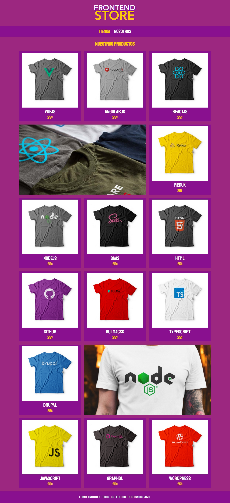

# Tienda de Ropa "[DevTShirt Shop](https://leyva9.github.io/Static-Projects/techShirtsShop/index.html)"

Bienvenidos a la página web de [DevTShirt Shop](https://leyva9.github.io/Static-Projects/techShirtsShop/index.html), tu destino para la mejor selección de ropa con marcas de tecnologías usadas por desarrolladores.

## Vista previa de la Página Web

### Versión para Desktop

## Características Destacadas
- Navegación sencilla y amigable para el usuario.
- Ropa con etiquetas atractivas para desarroladores.
  
## Cómo Usar [DevTShirt Shop](https://leyva9.github.io/Static-Projects/techShirtsShop/index.html)

1. Visita la [página de inicio de FashionWeb](https://leyva9.github.io/Static-Projects/techShirtsShop/index.html).
PD: Esta pagina aun esta en desarrollo.

## Tecnologías Utilizadas

FashionWeb se ha desarrollado utilizando las siguientes tecnologías web:

- HTML5
- CSS3

## Equipo de Desarrollo

- [Luis Manuel Leyva-Hernández](https://github.com/Leyva9) - Desarrollador Frontend

## Contribuciones

¡Agradecemos las contribuciones de la comunidad! Si deseas contribuir a FashionWeb, por favor sigue estas pautas:

1. Abre un issue para discutir las nuevas características o problemas.
2. Realiza un fork del repositorio.
3. Crea una rama para tu contribución.
4. Trabaja en tu contribución.
5. Envía un pull request.

## Licencia

Este proyecto está bajo la Licencia MIT. Para más detalles, consulta el archivo [LICENSE](LICENSE).

¡Esperamos que disfrutes de tu experiencia en DevTShirt Shop!
